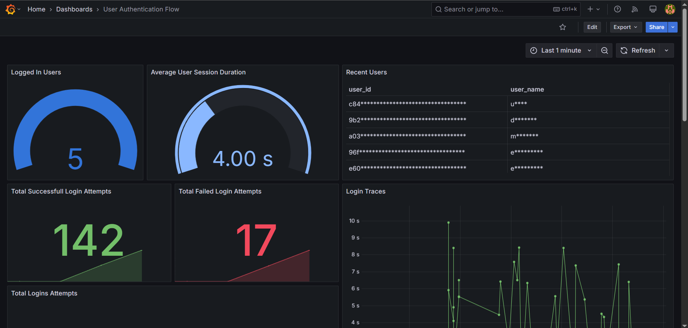

# AS - Assignment 1

## Made by: Alexandre Ribeiro, 108122

## Tracked Feature

The feature tracked in this assignment is the **User Authentication** feature of the eShop application. This includes the login and logout functionalities, which are critical for user management and security.

The following diagrams illustrate the flow of the login and logout processes, aswell as the tech stack used in the eShop application.

## Observability Metrics and Traces

The User Authentication feature is monitored using various metrics and traces through OpenTelemetry, which are then visualized in Grafana.

### Metrics
The following metrics are tracked:

- **Active Users**
  - `identity_active_users`: Number of currently logged-in users
  - `identity_active_user_sessions`: Detailed information about active sessions

- **Authentication Events**
  - `identity_successful_logins_total`: Counter of successful login attempts
  - `identity_failed_logins_total`: Counter of failed login attempts
  - `identity_login_event`: Simple counter for login events
  - `identity_user_login_event`: Detailed login events with user information
  - `identity_user_logout_event`: Detailed logout events with user information

- **Session Analytics**
  - `identity_session_duration_seconds`: Histogram of user session durations

### Traces
The following activities are traced:

- **Login Process**
  - Activity: `UserLogin`
  - Tags: user.id (censored), client.id, authentication.success, authentication.type

- **User Sessions**
  - Activity: `UserSession`
  - Tags: user.id (censored), user.name (censored), session.start, client.id
  - Long-running activity that spans from login to logout

- **Logout Process**
  - Activity: `UserLogout`
  - Tags: user.id (censored), user.displayName (censored), session duration and timestamps

Note: The user-identifying information is censored for privacy, showing only partial data.

### Technology Stack
The **User Authentication** flows are implemented using the Web App, the Identity API and its database:


### Login Flow


### Logout Flow


## How to run the application

After cloning the repository, you can use the following command to run the application :

```bash
dotnet run --project src/eShop.AppHost/eShop.AppHost.csproj
```

This will start the application on `https://localhost:7298/` by default. You can access the application in your web browser.

For the observability features, you have to use Docker to run the appropriate containers:
  
```bash
docker compose up -d
```

This will start the following services:
- **Grafana**: Access it at `http://localhost:3000/` (default credentials: admin/admin)
- **Prometheus**: Access it at `http://localhost:9090/`
- **Jaeger**: Access it at `http://localhost:16686/`

## How to run the tests

The load test scripts are located in the `tests/k6` directory. You can run them using the following command:

```bash
k6 run tests/k6/identity-login-test.js
```

More details about the tests can be found in the `README.md` file located in the `tests/k6` directory.

## How to view the observability data

The observability data can be viewed in Grafana. After starting the Docker containers, the dashboards are automatically imported into Grafana. You can access them at `http://localhost:3000/`, using the default credentials (admin/admin).

There are two dashboards available:
 - **User Authentication Flow** - Displays the metrics and traces related to the login and logout processes.
 


 - **ASP.NET Core** - Displays the metrics and traces related to the ASP.NET Core application.


The first dashboard is the one that contains the observability data tracked in this assignment, while the second one is a general dashboard for the ASP.NET Core application, imported from https://grafana.com/grafana/dashboards/19924-asp-net-core/.